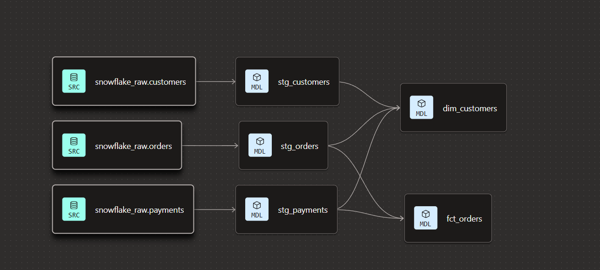

# 🛒 Jaffle Shop - dbt Project

Ce projet transforme les données brutes de vente en modèles analytiques via Snowflake et dbt.

## 🏗️ Architecture des données
Voici le graphe de dépendances (Lineage) de nos modèles :

## 🛠️ Couches du projet
* **Staging** : Nettoyage et normalisation.
* **Marts** : Création de la table de faits `fct_orders` et de la dimension `dim_customers`.

**ce que l'on a fait**:

**1. Architecture Modern Data Stack**

séparé le stockage de la donnée brute de la donnée prête à l'analyse en utilisant Snowflake comme moteur de calcul et dbt comme chef d'orchestre des transformations.

**2. Le Framework d'Ingénierie (ELT)**
pas contenté de faire du SQL, mais structuré le projet :

**Sources** : Déclaration et isolation des données brutes.

**Staging** : Nettoyage, renommage et typage (la "douche" des données).

**Marts** : Modélisation en schéma en étoile avec des tables de faits (fct_) pour les mesures et des dimensions (dim_) pour le contexte.

**3. La Qualité et l'Intégrité**
 automatisé la confiance dans les données grâce aux tests :

**Tests génériques** : unique et not_null.

**Intégrité référentielle** : relationships pour garantir que chaque vente est liée à un client réel.

**Validation métier** : accepted_values pour contrôler les statuts.

**4. Les "Best Practices" Software**
traité la data comme du code :

**Versionnage** : Utilisation de Git & GitHub pour gérer les changements.

**Revue de code** : Création de Pull Requests documentées.

**CI/CD** : Mise en place d'environnements séparés (Dev vs Prod) et automatisation des jobs de déploiement.
